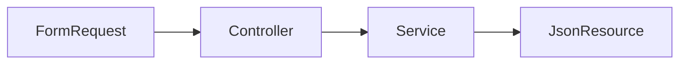
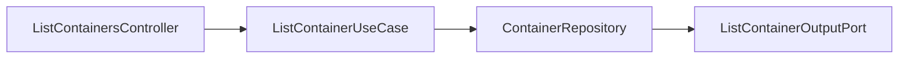

# Cargo Dashboard

Aplicação fictícia para analisar os dados de um pátio de containers para exportação.

---

## Tecnologias utilizadas
### Front-end
- **Framework:** [Vue3](https://vuejs.org/)
- **UI:** [Vuetify](https://vuetifyjs.com/en/)
- **Routing:** [VueRouter](https://router.vuejs.org/)
- **Data fetching:** [VueQuery](https://tanstack.com/query/latest/docs/framework/vue/installation)
- **Code formatting**: [ESLint](https://eslint.org/) / [Prettier](https://prettier.io/)

### Backend
- **Framework:** [Laravel](https://laravel.com/)
- **Database:** [PostgreSQL](https://www.postgresql.org/)
- **Testing:** [PestPHP](https://pestphp.com/)

### Developing
- [Docker](https://www.docker.com/)
- [Conventional Commits](https://www.conventionalcommits.org/en/v1.0.0/)

## Clean Architecture
Optando por sair um pouco do padrão do laravel onde passamos pelo seguinte fluxo


Optei por implementar a API utilizando [Clean Architecture](https://blog.cleancoder.com/uncle-bob/2012/08/13/the-clean-architecture.html) do Uncle Bob.
Visto que é uma Dashboard que pode ser utilizado por uma equipe de BI, os dados podem vir de outros lugares além do banco de dados da aplicação.
Com a inversão de dependência que o clean arch propoem, essa alteração será fácil e não será necessário tocar na parte do código que define as regras
da aplicação e principalmente as de negócios.

Explicando como ficou a listagem de containers



A Aplicação fica responsável por montar o UseCase e definir como deve ser o comportamento, ou seja, a aplicação que define
qual vai ser o repositório concreto que vai buscar os dados dos containers e qual porta de saída irá retornar os dados

A aplicação monta o output do ListContainersUseCase no [AppServiceProvider](api/app/Providers/AppServiceProvider.php) e o repositório em [RepositoryServiceProvider](api/app/Providers/AppServiceProvider.php)
````php
// app/Providers/AppServiceProvider.php
$this->app->bind(ListContainerOutputPort::class, ListContainersArrayOutput::class);

// app/Providers/RepositoryServiceProvider.php
$this->app->bind(ContainerRepository::class, function ($app) {
    return new EloquentContainerRepository(new Container());
});
````

As regras de aplicaçoes ficaram dentro do UseCase, são elas:
- Se não for passada uma página nos filtros, então será retornada a primeira
- Se não for passada uma quantida de itens por página, então será 10


