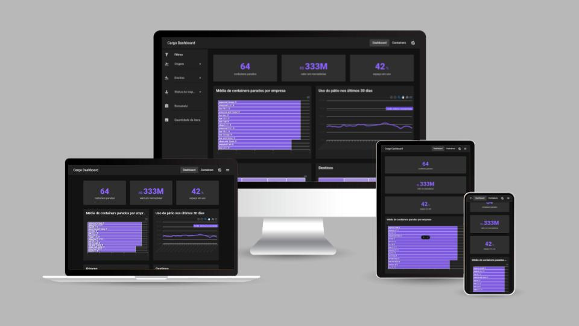
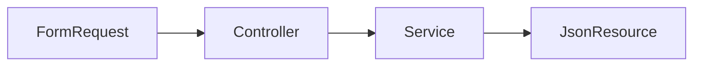
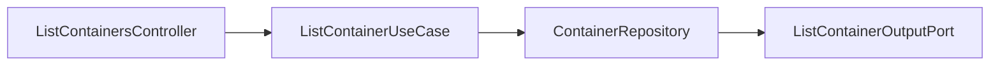

# Cargo Dashboard

Aplicação fictícia para analisar os dados de um pátio de containers para exportação.

[](https://conventionalcommits.org)
[](https://github.com/medinaalexandre/cargo-dashboard/actions/workflows/run-tests.yml)
---



## Executando a aplicação
Para executar a aplicação é necessário possuir o [Docker](https://www.docker.com/) instalado e rodar os seguintes comandos:
```shell
chmod +x build.sh
./build.sh
```

## 1. Tecnologias utilizadas
### 1.1 Front-end
- **Framework:** [Vue3](https://vuejs.org/)
- **UI:** [Vuetify](https://vuetifyjs.com/en/)
- **Routing:** [VueRouter](https://router.vuejs.org/)
- **Data fetching:** [VueQuery](https://tanstack.com/query/latest/docs/framework/vue/installation)
- **Code formatting**: [ESLint](https://eslint.org/) / [Prettier](https://prettier.io/)

### 1.2 Back-end
- **Framework:** [Laravel](https://laravel.com/)
- **Database:** [PostgreSQL](https://www.postgresql.org/)
- **Testing:** [PestPHP](https://pestphp.com/)

### 1.3 Developing
- [Docker](https://www.docker.com/)
- [Conventional Commits](https://www.conventionalcommits.org/en/v1.0.0/)

## 2. Clean Architecture
Em vez de seguir o padrão tradicional do Laravel, onde o fluxo geralmente é:


Optei por implementar a API utilizando [Clean Architecture](https://blog.cleancoder.com/uncle-bob/2012/08/13/the-clean-architecture.html) do Uncle Bob.

Dado que esta aplicação é uma Dashboard que pode ser utilizada por uma equipe de BI, existe a possibilidade de que os
dados venham de diversas fontes além do banco de dados da aplicação. Com a Clean Architecture, graças a
**Inversão de Dependência** de forma fácil e rápida podemos trocar as fontes de dados sem alterar as regras de negócio
da aplicação. Caso aumente o uso da dashboard que possui consultas pesadas, podemos facilmente adicionar uma camada
de cache utilizando Redis por exemplo, assim aumentando a **escabilidade** da aplicação.

### 2.1 Explicando a Listagem de Containers



A Aplicação fica responsável por montar o UseCase e definir como deve ser o comportamento, ou seja, a aplicação que define
qual vai ser o repositório concreto que vai buscar os dados dos containers e qual porta de saída irá retornar os dados.

A aplicação monta o output do ListContainersUseCase no [AppServiceProvider](api/app/Providers/AppServiceProvider.php)
e o repositório em [RepositoryServiceProvider](api/app/Providers/AppServiceProvider.php):
````php
// app/Providers/AppServiceProvider.php
$this->app->bind(ListContainerOutputPort::class, ListContainersArrayOutput::class);

// app/Providers/RepositoryServiceProvider.php
$this->app->bind(ContainerRepository::class, function ($app) {
    return new EloquentContainerRepository(new Container());
});
````

### 2.2 Regras da Aplicação
As regras de aplicação ficaram dentro do UseCase, são elas:
- Se não for passada uma página nos filtros, então será retornada a primeira.
- Se não for passada uma quantidade de itens por página, então será 10.

### 2.3 Regras de Domínio
As regras de domínio ficaram dentro da camada de domínio:
- O limite do pátio em ContainerYard para calcular o espaço utilizado.

## 3. Testes
Os testes da API estão com uma cobertura de **94.8%**. Para reduzir a quantidade de código escrito e facilitar os testes
dos filtros, foi utilizado o [Dataset](https://pestphp.com/docs/datasets)
[ListContainerFilterParamsData.php](api/tests/Datasets/ListContainerFilterParamsData).


